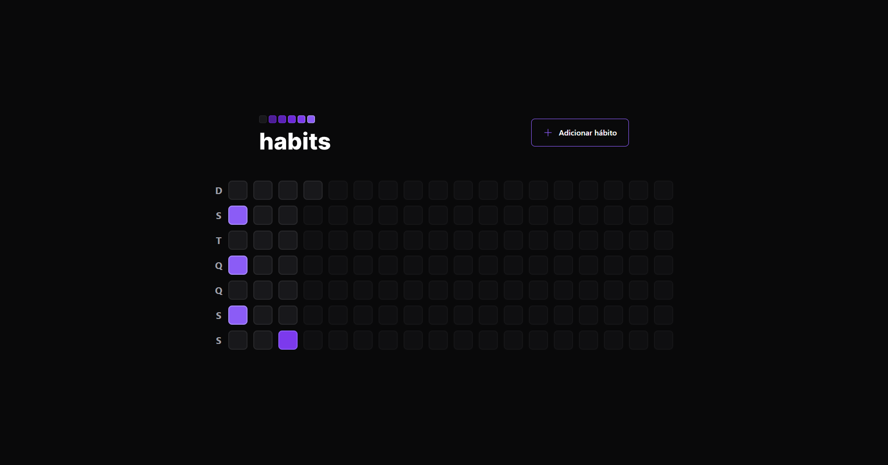
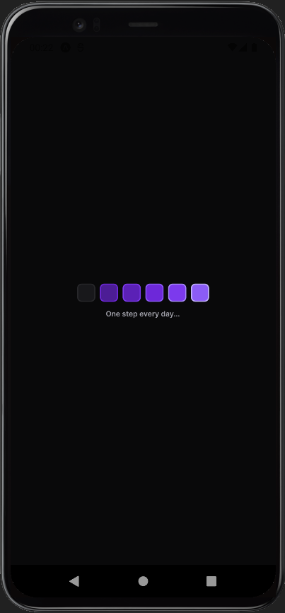
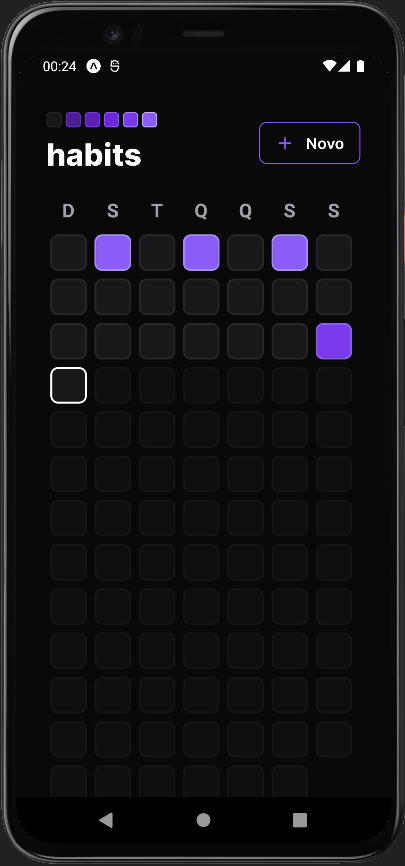

<h1 align="center">Next Level Week - Setup</h1>

Conteúdos produzidos ao participar do evento Next Level Week - Setup, da Rocketseat. Nele desenvolvemos uma aplicação de controle de hábitos, a partir de um módulo de <b>back-end</b>, e com as versões <b>web</b> e <b>mobile</b> no front-end.
 

## Tecnologias Front Web :rocket:

- #### Dependências

  - React
  - Radix UI
  - Axios
  - clsx
  - dayjs
  - phosphor-react

- #### Dependências de desenvolvimento
  - Typescript
  - Vite
  - Tailwindcss
  - Postcss
  - Autoprefixer
  
___
  

   

## Tecnologias Front Mobile :iphone:

- #### Dependências

  - React-native
  - Expo
  - React-navigation
  - Axios
  - clxs
  - dayjs
  - Nativewind
  - React-native-svg
  - React-native-screens

- #### Dependências de desenvolvimento

  - Typescript
  - Tailwindcss
  - React-native-svg-transformer

___

## Tecnologias Back-end :computer:

- #### Dependências

  - Fastify
  - Prisma
  - dayjs
  - zod

- #### Dependências de desenvolvimento

  - Typescript
  - tsx

___

#Rocketseat #NeverStopLearning #OneStepEveryDay #NLWSetup

